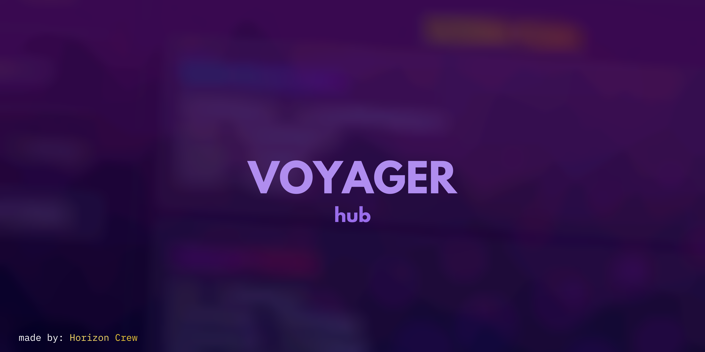

# CANCELLED!!!
yes sadly, I will be going on and passing this project to one of my friends. I will be open sourcing the __TEMPLATE__ of the script, that way u know where to start. We apologize for not making this possible, still thank you for being here with us.

A hub with *sleek modern design* and **powerful, stable scripts** that are there to properly enhance your experienc- I gave up..
THIS HUB IS SO KEWL LIKE VERY PROFESSIONAL KEWL!! IT HAS UH:

- 3+ supported games
- Sleek UI
- idk

> [!WARNING]
> Some executors may experience errors due to the compatibility of the executor. If encounter please do the follow following: Make an issue within the repository or join the discord.

## Why Voyager??
Cuzzzzzz:
We are professionals at making scriptz! And takes this hub veyr veyr seriously,, just look at my serious face! Oh wait, you can't :<
We have good communication and stuff
yeah
SO USE IT NOW
(or else.)

## Credits:
`Remiebun` - Lead developer and creator of Voyager.

`Nuga` - Co-creator and manager.

#### Special thanks!

`.ftgs` - Creator of [Wind UI](https://github.com/Footagesus/WindUI)

`catt` - Beta Tester and Former Owner.

Teo - Beta Tester

ConnorLC - for being, idk he helped ig
